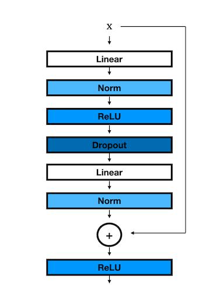
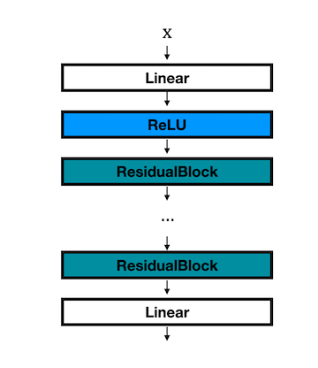

# 10-714 作业 2

在本次作业中，你将在 needle 框架中实现一个神经网络库。提醒：__你必须在 drive 中保存一份副本__。

## 作业环境搭建

```python
# Code to set up the assignment
from google.colab import drive
drive.mount('/content/drive')
%cd /content/drive/MyDrive/
!mkdir -p 10714
%cd /content/drive/MyDrive/10714
!git clone https://github.com/dlsys10714/hw2.git
%cd /content/drive/MyDrive/10714/hw2

!pip3 install --upgrade --no-deps git+https://github.com/dlsys10714/mugrade.git
```

---

## 问题 0

本次作业建立在作业 1 的基础之上。首先，在你的作业 2 目录中，进入 `python/needle` 目录下的 `autograd.py`、`ops.py` 文件，把你作业 1 的解答填入 `### BEGIN YOUR SOLUTION` 与 `### END YOUR SOLUTION` 之间。

**注意：** 自作业 1 以来，我们新增了一些功能（尤其是 `autograd.py` 文件），因此重要的是**只复制你的解答部分**，而不是直接复制整个旧文件。

```python
import sys
sys.path.append('./python')
sys.path.append('./apps')
```

---

## 问题 1

在第一个问题中，你将实现几种不同的权重初始化方法。这些代码将写在 `python/needle/init.py` 文件中，该文件包含了一系列使用各种随机与常量初始化方式来初始化 needle 张量的例程。按照已有初始化器的相同方式（你在下面的函数中需要调用例如 `init.rand` 或 `init.randn`），实现以下常见的初始化方法。在所有情况下，函数都应返回 `fan_in` × `fan_out` 的 2D 张量（对其它尺寸的扩展可以通过例如 reshape 来实现）。

### Xavier 均匀初始化
`xavier_uniform(fan_in, fan_out, gain=1.0, **kwargs)`

按照论文 [Understanding the difficulty of training deep feedforward neural networks](https://proceedings.mlr.press/v9/glorot10a/glorot10a.pdf) 中描述的方法，使用均匀分布填充输入张量。生成的张量将从 $\mathcal{U}(-a, a)$ 中采样，其中

$$
a = \text{gain} \times \sqrt{\frac{6}{\text{fan\_in} + \text{fan\_out}}}
$$

将剩余的 `**kwargs` 参数传递给相应的 `init` 随机调用。

##### 参数
- `fan_in` - 输入的维度
- `fan_out` - 输出的维度
- `gain` - 可选的缩放因子

___

### Xavier 正态初始化
`xavier_normal(fan_in, fan_out, gain=1.0, **kwargs)`

按照论文 [Understanding the difficulty of training deep feedforward neural networks](https://proceedings.mlr.press/v9/glorot10a/glorot10a.pdf) 中描述的方法，使用正态分布填充输入张量。生成的张量将从 $\mathcal{N}(0, \text{std}^2)$ 中采样，其中

$$
	ext{std} = \text{gain} \times \sqrt{\frac{2}{\text{fan\_in} + \text{fan\_out}}}
$$

##### 参数
- `fan_in` - 输入的维度
- `fan_out` - 输出的维度
- `gain` - 可选的缩放因子

___

### Kaiming 均匀初始化
`kaiming_uniform(fan_in, fan_out, nonlinearity="relu", **kwargs)`

按照论文 [Delving deep into rectifiers: Surpassing human-level performance on ImageNet classification](https://arxiv.org/pdf/1502.01852.pdf) 中描述的方法，使用均匀分布填充输入张量。生成的张量将从 $\mathcal{U}(-\text{bound}, \text{bound})$ 中采样，其中

$$
	ext{bound} = \text{gain} \times \sqrt{\frac{3}{\text{fan\_in}}}
$$

对 ReLU 使用推荐的增益值：$\text{gain}=\sqrt{2}$。

##### 参数
- `fan_in` - 输入的维度
- `fan_out` - 输出的维度
- `nonlinearity` - 非线性函数

___

### Kaiming 正态初始化
`kaiming_normal(fan_in, fan_out, nonlinearity="relu", **kwargs)`

按照论文 [Delving deep into rectifiers: Surpassing human-level performance on ImageNet classification](https://arxiv.org/pdf/1502.01852.pdf) 中描述的方法，使用正态分布填充输入张量。生成的张量将从 $\mathcal{N}(0, \text{std}^2)$ 中采样，其中

$$
	ext{std} = \frac{\text{gain}}{\sqrt{\text{fan\_in}}}
$$

对 ReLU 使用推荐的增益值：$\text{gain}=\sqrt{2}$。

##### 参数
- `fan_in` - 输入的维度
- `fan_out` - 输出的维度
- `nonlinearity` - 非线性函数

```bash
!python3 -m pytest -v -k "test_init"
```

```bash
!python -m mugrade submit 'YOUR_GRADER_KEY_HERE' -k "init" -s
```

---

## 问题 2

在本问题中，你将在 `python/needle/nn.py` 中实现额外的模块。具体来说，对于下面描述的各个模块，在构造函数中初始化模块的变量，并填写 `forward` 方法。

___

### Linear
`needle.nn.Linear(in_features, out_features, bias=True, device=None, dtype="float32")`

对输入数据应用线性变换：$y = xA^T + b$。输入形状为 $(N, H_{in})$，其中 $H_{in}=\text{in_features}$。输出形状为 $(N, H_{out})$，其中 $H_{out}=\text{out_features}$。

务必小心地将偏置项显式广播到正确的形状——Needle 不支持隐式广播。

另外注意，对于包括本层在内的所有层，你都应该**先初始化权重张量，再初始化偏置张量**，并且只能使用 `init` 模块中的函数来初始化所有参数。

##### 参数
- `in_features` - 每个输入样本的大小
- `out_features` - 每个输出样本的大小
- `bias` - 如果设为 `False`，该层将不学习可加偏置

##### 变量
- `weight` - 形状为 (`in_features`, `out_features`) 的可学习权重。其值应使用 `fan_in = in_features` 的 Kaiming 均匀初始化进行初始化
- `bias` - 形状为 (`out_features`) 的可学习偏置。其值应使用 `fan_in = out_features` 的 Kaiming 均匀初始化进行初始化。**注意这里的 `fan_in` 选择不同，这是由于它们各自的尺寸所致**。

```bash
!python3 -m pytest -v -k "test_nn_linear"
```

```bash
!python -m mugrade submit 'YOUR_GRADER_KEY_HERE' -k "nn_linear"
```

___

### ReLU
`needle.nn.ReLU()`

对输入逐元素应用修正线性单元函数：
$ReLU(x) = max(0, x)$。

如果你之前在实现 ReLU 的反向传播时是用 ReLU 本身来表达的，请注意这在数值上是不稳定的，后续很可能会出问题。相反，可以考虑把 ReLU 的导数写成 $I\{x>0\}$，我们人为规定在 $x=0$ 处的导数为 0。（这是一个_次可微_函数。）

```bash
!python3 -m pytest -v -k "test_nn_relu"
```

```bash
!python -m mugrade submit 'YOUR_GRADER_KEY_HERE' -k "nn_relu"
```

___

### Sequential
`needle.nn.Sequential(*modules)`

按传入构造函数的顺序对输入依次应用一系列模块，并返回最后一个模块的输出。这些模块应保存在 `.module` 属性中：你_不应_重定义任何魔术方法（如 `__getitem__`），因为这可能与我们的测试不兼容。

##### 参数
- `*modules` - 任意多个类型为 `needle.nn.Module` 的模块

```bash
!python3 -m pytest -v -k "test_nn_sequential"
```

```bash
!python -m mugrade submit 'YOUR_GRADER_KEY_HERE' -k "nn_sequential"
```

___

### LogSumExp

`needle.ops.LogSumExp(axes)`

这里你需要在 `python/ops.py` 文件中再实现一个算子（就像你在作业 1 中做的那样）。通过减去最大元素，对输入应用数值稳定的 log-sum-exp 函数。

$$
	ext{LogSumExp}(z) = \log (\sum_{i} \exp (z_i - \max(z))) + \max(z)
$$

#### 参数
- `axes` - 要求和以及取最大元素所沿的轴元组。这遵循与 `needle.ops.Summation()` 相同的约定

```bash
!python3 -m pytest -v -k "test_op_logsumexp"
```

```bash
!python -m mugrade submit 'YOUR_GRADER_KEY_HERE' -k "op_logsumexp"
```

___

### SoftmaxLoss

`needle.nn.SoftmaxLoss()`

应用如下定义的 softmax 损失（与作业 1 中的实现相同），输入为 logits 张量和真实标签张量（标签以数字列表的形式表示，*而不是* one-hot 编码）。

注意你现在可以使用 `init.one_hot` 函数，而不必自己写。注意：为此目的，你将需要使用刚刚实现的数值稳定的 logsumexp 算子。

$$
\ell_\text{softmax}(z,y) = \log \sum_{i=1}^k \exp z_i - z_y
$$

```bash
!python3 -m pytest -v -k "test_nn_softmax_loss"
```

```bash
!python -m mugrade submit 'YOUR_GRADER_KEY_HERE' -k "nn_softmax_loss"
```

___

### LayerNorm1d
`needle.nn.LayerNorm1d(dim, eps=1e-5, device=None, dtype="float32")`

按照论文 [Layer Normalization](https://arxiv.org/abs/1607.06450) 中的描述，对输入的 mini-batch 应用层归一化。

$$
y = w \circ \frac{x_i - \textbf{E}[x]}{((\textbf{Var}[x]+\epsilon)^{1/2})} + b
$$

其中 $\textbf{E}[x]$ 表示输入的经验均值，$\textbf{Var}[x]$ 表示它们的经验方差（注意这里我们使用的是“无偏”方差估计，即除以 $N$ 而不是 $N-1$），$w$ 和 $b$ 分别表示可学习的标量权重和偏置。注意你可以假设该层的输入是一个 2D 张量，第一个维度是 batch，第二个维度是特征。

##### 参数
- `dim` - 通道数
- `eps` - 为数值稳定性而加到分母上的值

##### 变量
- `weight` - 尺寸为 `dim` 的可学习权重，元素初始化为 1
- `bias` - 形状为 `dim` 的可学习偏置，元素初始化为 0 **（由 1 改为了 0）**

```bash
!python3 -m pytest -v -k "test_nn_layernorm"
```

```bash
!python -m mugrade submit 'YOUR_GRADER_KEY_HERE' -k "nn_layernorm"
```

___

### Flatten
`needle.nn.Flatten()`

接收形状为 `(B,X_0,X_1,...)` 的张量，将除 batch 之外的所有维度展平，使输出形状为 `(B, X_0 * X_1 * ...)`。

```bash
!python3 -m pytest -v -k "test_nn_flatten"
```

```bash
!python -m mugrade submit 'YOUR_GRADER_KEY_HERE' -k "nn_flatten"
```

___

### BatchNorm1d
`needle.nn.BatchNorm1d(dim, eps=1e-5, momentum=0.1, device=None, dtype="float32")`

按照论文 [Batch Normalization: Accelerating Deep Network Training by Reducing Internal Covariate Shift](https://arxiv.org/abs/1502.03167) 中的描述，对输入的 mini-batch 应用批归一化。

$$
y = w \circ \frac{z_i - \textbf{E}[x]}{((\textbf{Var}[x]+\epsilon)^{1/2})} + b
$$

但这里的均值和方差是指_批_维度上的均值和方差。该函数还会为每层所有特征计算均值/方差的滑动平均 $\hat{\mu}, \hat{\sigma}^2$，并在测试时用这些量进行归一化：

$$
y = \frac{(x - \hat{\mu})}{((\hat{\sigma}^2_{i+1})_j+\epsilon)^{1/2}}
$$

BatchNorm 在测试时使用均值和方差的滑动估计，而不是 batch 统计量，也就是说，在 BatchNorm 层上调用 `model.eval()` 之后，其 `training` 标志为 `False`。

要计算滑动估计，你可以使用以下公式：

$$
\hat{x_{new}} = (1 - m) \hat{x_{old}} + mx_{observed}
$$

其中 $m$ 是动量。

##### 参数
- `dim` - 输入维度
- `eps` - 为数值稳定性而加到分母上的值
- `momentum` - 用于计算滑动均值和滑动方差的值

##### 变量
- `weight` - 尺寸为 `dim` 的可学习权重，元素初始化为 1
- `bias` - 尺寸为 `dim` 的可学习偏置，元素初始化为 0
- `running_mean` - 评估时使用的滑动均值，元素初始化为 0
- `running_var` - 评估时使用的滑动（无偏）方差，元素初始化为 1

```bash
!python3 -m pytest -v -k "test_nn_batchnorm"
```

```bash
!python -m mugrade submit 'YOUR_GRADER_KEY_HERE' -k "nn_batchnorm"
```

___

### Dropout
`needle.nn.Dropout(p = 0.5)`

在训练期间，使用伯努利分布的采样，以概率 `p` 随机将输入张量的某些元素置零。如论文 [Improving neural networks by preventing co-adaption of feature detectors](https://arxiv.org/abs/1207.0580) 所述，这已被证明是一种有效的正则化技术，可防止神经元协同适应。在评估期间，该模块仅计算恒等函数。

$$
\begin{aligned}
\hat{z}_{i+1} &= \sigma_i (W_i^T z_i + b_i) \\
(z_{i+1})_j &=
    \begin{cases}
    (\hat{z}_{i+1})_j /(1-p) & \text{以概率 } 1-p \\
    0 & \text{以概率 } p
    \end{cases}
\end{aligned}
$$

**重要：** 如果 Dropout 模块的标志 `training=False`，你不应“丢弃”任何权重。也就是说，dropout 仅在训练期间应用，评估期间不应用。注意 `training` 是 `nn.Module` 中的一个标志。

##### 参数
- `p` - 元素被置零的概率

```bash
!python3 -m pytest -v -k "test_nn_dropout"
```

```bash
!python -m mugrade submit 'YOUR_GRADER_KEY_HERE' -k "nn_dropout"
```

___

### Residual
`needle.nn.Residual(fn: Module)`

给定模块 $\mathcal{F}$ 和输入张量 $x$，应用残差（跳跃）连接，返回 $\mathcal{F}(x) + x$。

##### 参数
- `fn` - 类型为 `needle.nn.Module` 的模块

```bash
!python3 -m pytest -v -k "test_nn_residual"
```

```bash
!python -m mugrade submit 'YOUR_GRADER_KEY_HERE' -k "nn_residual"
```

---

## 问题 3

实现以下优化器的 `step` 函数。确保你的优化器_不会_原地修改张量的梯度。

我们加入了一些测试，以确保你不会消耗过多内存——如果没有在合适的位置使用 `.data` 或 `.detach()`，就可能构建出越来越大的计算图（不仅是在优化器中，在之前的模块中也是如此），从而导致内存过多。你可以自行决定是否忽略那些包含字符串 `memory_check` 的测试。

___

### SGD
`needle.optim.SGD(params, lr=0.01, momentum=0.0, weight_decay=0.0)`

实现随机梯度下降（可选带动量，如下所示用 $\beta$ 表示）。

$$
\begin{aligned}
    u_{t+1} &= \beta u_t + (1-\beta) \nabla_\theta f(\theta_t) \\
    \theta_{t+1} &= \theta_t - \alpha u_{t+1}
\end{aligned}
$$

##### 参数
- `params` - 要优化的、类型为 `needle.nn.Parameter` 的参数可迭代对象
- `lr` (*float*) - 学习率
- `momentum` (*float*) - 动量因子
- `weight_decay` (*float*) - 权重衰减（L2 惩罚）

```bash
!python3 -m pytest -v -k "test_optim_sgd"
```

```bash
!python -m mugrade submit 'YOUR_GRADER_KEY_HERE' -k "optim_sgd"
```

___

### Adam
`needle.optim.Adam(params, lr=0.01, beta1=0.9, beta2=0.999, eps=1e-8, weight_decay=0.0)`

实现 Adam 算法，该算法在论文 [Adam: A Method for Stochastic Optimization](https://arxiv.org/abs/1412.6980) 中提出。

$$
\begin{aligned}
u_{t+1} &= \beta_1 u_t + (1-\beta_1) \nabla_\theta f(\theta_t) \\
v_{t+1} &= \beta_2 v_t + (1-\beta_2) (\nabla_\theta f(\theta_t))^2 \\
\hat{u}_{t+1} &= u_{t+1} / (1 - \beta_1^t) \quad \text{(偏差修正)} \\
\hat{v}_{t+1} &= v_{t+1} / (1 - \beta_2^t) \quad \text{(偏差修正)}\\
\theta_{t+1} &= \theta_t - \alpha \hat{u}_{t+1}/(\hat{v}_{t+1}^{1/2}+\epsilon)
\end{aligned}
$$

**重要：** 注意你是否应用了偏差修正。

##### 参数
- `params` - 要优化的、类型为 `needle.nn.Parameter` 的参数可迭代对象
- `lr` (*float*) - 学习率
- `beta1` (*float*) - 用于计算梯度滑动平均的系数
- `beta2` (*float*) - 用于计算梯度平方滑动平均的系数
- `eps` (*float*) - 为改善数值稳定性而加到分母上的项
- `bias_correction` - 是否对 $u, v$ 使用偏差修正
- `weight_decay` (*float*) - 权重衰减（L2 惩罚）

```bash
!python3 -m pytest -v -k "test_optim_adam"
```

```bash
!python -m mugrade submit 'YOUR_GRADER_KEY_HERE' -k "optim_adam"
```

---

## 问题 4

在本问题中，你将实现两个数据原语：`needle.data.DataLoader` 和 `needle.data.Dataset`。`Dataset` 存储样本及其对应标签，`DataLoader` 在 `Dataset` 之上封装一个可迭代对象，以便于访问样本。

对于本问题，你将在 `python/needle/data.py` 中工作。首先，把你在上一份作业中的 `parse_mnist` 解答复制到 `parse_mnist` 函数中。

### 数据变换

首先我们实现几个处理图像时很有用的变换。目前我们只做水平翻转和随机裁剪。在 `data.py` 中填写以下函数。

___

#### RandomFlipHorizontal
`needle.data.RandomFlipHorizontal(p = 0.5)`

以概率 `p` 水平翻转图像。

##### 参数
- `p` (*float*) - 翻转输入图像的概率

___

#### RandomCrop
`needle.data.RandomCrop(padding=3)`

在图像的所有边都加上填充，然后在随机位置把图像裁剪回原始大小。返回与原始图像大小相同的图像。

##### 参数
- `padding` (*int*) - 图像每条边上的填充量

```bash
!python3 -m pytest -v -k "flip_horizontal"
!python3 -m pytest -v -k "random_crop"
```

```bash
!python -m mugrade submit 'YOUR_GRADER_KEY_HERE' -k "flip_horizontal"
!python -m mugrade submit 'YOUR_GRADER_KEY_HERE' -k "random_crop"
```

___

### Dataset

每个 `Dataset` 子类都必须实现三个函数：`__init__`、`__len__` 和 `__getitem__`。`__init__` 函数初始化图像、标签和变换；`__len__` 函数返回数据集中样本的数量；`__getitem__` 函数在给定索引 `idx` 处取回数据集中的一个样本，对图像调用变换函数（如果适用），并将图像和标签转换为 numpy 数组（数据将在别处被转换为张量）。请在 `MNISTDataset` 类中填写这些函数：

___

### MNISTDataset
`needle.data.MNISTDataset(image_filesname, label_filesname, transforms)`

##### 参数
- `image_filesname` - 包含图像的文件路径
- `label_filesname` - 包含标签的文件路径
- `transforms` - 一个可选的、要应用于数据的变换列表

```bash
!python3 -m pytest -v -k "test_mnist_dataset"
```

```bash
!python -m mugrade submit 'YOUR_GRADER_KEY_HERE' -k "mnist_dataset"
```

___

### Dataloader

Dataloader 类提供了一个接口，用于在 Dataset 对象之上组装适合基于 SGD 方法训练的 mini-batch 样例。为了构建典型的 Dataloader 接口（允许用户遍历数据集中所有的 mini-batch），你需要实现类中的 `__iter__()` 和 `__next__()` 调用：`__iter__()` 在迭代开始时被调用，而 `__next__()` 被调用来获取下一个 mini-batch。请注意，后续对 `next` 的调用要求你返回接下来的 batch，因此 `next` 不是一个纯函数。

___

### Dataloader
`needle.data.Dataloader(dataset: Dataset, batch_size: Optional[int] = 1, shuffle: bool = False)`

组合数据集和采样器，并提供对该数据集的可迭代访问。

##### 参数
- `dataset` - `needle.data.Dataset` - 一个数据集
- `batch_size` - `int` - 以多大的 batch size 提供数据
- `shuffle` - `bool` - 设为 ``True`` 时每个 epoch 都重新打乱数据，默认 ``False``

```bash
!python3 -m pytest -v -k "test_dataloader"
```

```bash
!python -m mugrade submit 'YOUR_GRADER_KEY_HERE' -k "dataloader"
```

---

## 问题 5

既然你已经实现了神经网络库所需的所有组件，让我们构建并训练一个 MLP ResNet。对于本问题，你将在 `apps/mlp_resnet.py` 中工作。首先，按照以下描述填写 `ResidualBlock` 和 `MLPResNet` 函数：

### ResidualBlock
`ResidualBlock(dim, hidden_dim, norm=nn.BatchNorm1d, drop_prob=0.1)`

实现如下所示的残差块：



其中第一个线性层的 `in_features=dim`、`out_features=hidden_dim`，最后一个线性层的 `out_features=dim`。返回类型为 `nn.Module` 的块。

##### 参数
- `dim` (*int*) - 输入维度
- `hidden_dim` (*int*) - 隐藏维度
- `norm` (*nn.Module*) - 归一化方法
- `drop_prob` (*float*) - dropout 概率

___

### MLPResNet
`MLPResNet(dim, hidden_dim=100, num_blocks=3, num_classes=10, norm=nn.BatchNorm1d, drop_prob=0.1)`

实现如下所示的 MLP ResNet：



其中第一个线性层的 `in_features=dim`、`out_features=hidden_dim`，每个 ResidualBlock 的 `dim=hidden_dim`、`hidden_dim=hidden_dim//2`。返回类型为 `nn.Module` 的网络。

##### 参数
- `dim` (*int*) - 输入维度
- `hidden_dim` (*int*) - 隐藏维度
- `num_blocks` (*int*) - ResidualBlock 的数量
- `num_classes` (*int*) - 类别数
- `norm` (*nn.Module*) - 归一化方法
- `drop_prob` (*float*) - dropout 概率（0.1）

___

在把深度学习模型架构做对之后，让我们使用新的神经网络库组件来训练网络。具体来说，实现 `epoch` 和 `train_mnist` 函数。

### Epoch

`epoch(dataloader, model, opt=None)`

执行一个 epoch 的训练或评估，遍历整个训练数据集一次（就像之前作业中的 `nn_epoch`）。返回平均错误率 **（由准确率改为了错误率）**（作为 *float*）以及所有样本上的平均损失（作为 *float*）。如果给出了 `opt`，则在函数开始时将模型设置为 `training` 模式；如果未给出 `opt`（即 `None`），则将模型设置为 `eval`。

##### 参数
- `dataloader` (*`needle.data.DataLoader`*) - 从训练数据集返回样本的 dataloader
- `model` (*`needle.nn.Module`*) - 神经网络
- `opt` (*`needle.optim.Optimizer`*) - 优化器实例，或 `None`

___

### Train Mnist

`train_mnist(batch_size=100, epochs=10, optimizer=ndl.optim.Adam, lr=0.001, weight_decay=0.001, hidden_dim=100, data_dir="data")`

初始化一个训练 dataloader（`shuffle` 设为 `True`）和一个用于 MNIST 数据的测试 dataloader，并使用给定的优化器（如果 `opt` 不为 None）和 softmax 损失训练一个 `MLPResNet`，训练给定的 epoch 数。返回在最后一个训练 epoch 中计算得到的（训练准确率、训练损失、测试准确率、测试损失）元组。如果未指定任何参数，则使用默认参数。

##### 参数
- `batch_size` (*int*) - 训练和测试 dataloader 使用的 batch size
- `epochs` (*int*) - 训练的 epoch 数
- `optimizer` (*`needle.optim.Optimizer` 类型*) - 要使用的优化器类型
- `lr` (*float*) - 学习率
- `weight_decay` (*float*) - 权重衰减
- `hidden_dim` (*int*) - `MLPResNet` 的隐藏维度
- `data_dir` (*int*) - 包含 MNIST 图像/标签文件的目录

```bash
!python3 -m pytest -v -k "test_mlp"
```

```bash
!python -m mugrade submit 'YOUR_GRADER_KEY_HERE' -k "mlp_resnet"
```

---

我们鼓励你尝试 `mlp_resnet.py` 训练脚本。你可以研究在 Linear 层上使用不同初始化器、增大 dropout 概率、或者添加变换（通过 Dataset 的 `transforms=` 关键字参数传入列表，例如随机裁剪）所带来的效果。
